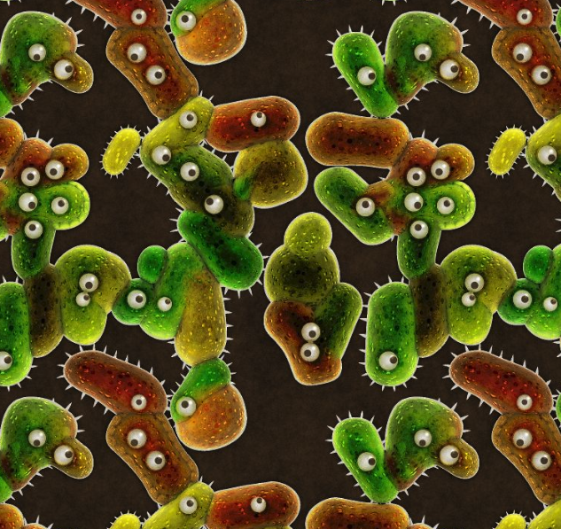
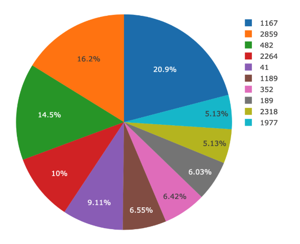
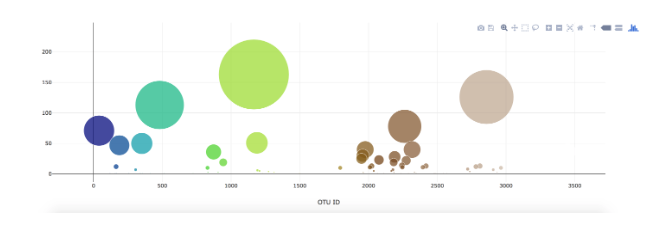
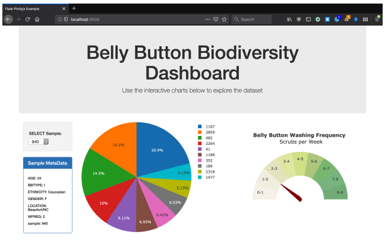

# Biodiversity

Built an interactive dashboard to explore the Biodiversity dataset and deployed the Flask app to Heroku.You can view the app here [Biodiversity](https://biodiversity123.herokuapp.com/)

- Used Plotly.js to build interactive charts for the dashboard.
    - Created a PIE chart that uses data from your samples route (`/samples/<sample>`) to display the top 10 samples.

    - Used `sample_values` as the values for the PIE chart.

    - Used `otu_ids` as the labels for the pie chart.

    - Used `otu_labels` as the hovertext for the chart.
    
    
    

- Created a Bubble Chart that uses data from your samples route (`/samples/<sample>`) to display each sample.

     - Used `otu_ids` for the x values.

     - Usde `sample_values` for the y values.

     - Used `sample_values` for the marker size.

     - Used `otu_ids` for the marker colors.

     - Use `otu_labels` for the text values.
     
 
 
Adapted the Gauge Chart to plot the Weekly Washing Frequency obtained from the /metadata/<sample>route. 
  
 
 
 
 
- Displayed the sample metadata from the route `/metadata/<sample>` showing each `key/value` pair from the metadata `JSON` object to the left of the pie chart.
     - The plots Update any time that a new sample is selected.
     

